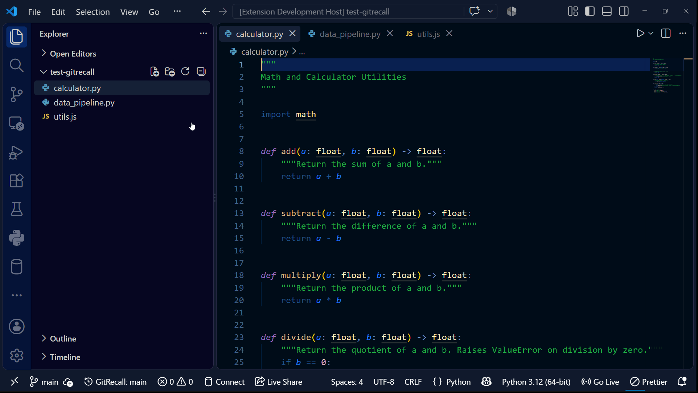

<div align="center">

  

  # GitRecall

  **Your tabs remember which branch they belong to.**

  <p align="center">
    <a href="https://marketplace.visualstudio.com/items?itemName=Saksham-Mann.gitrecall">
      
    </a>
    <a href="https://open-vsx.org/extension/Saksham-Mann/gitrecall">
      
    </a>
    <a href="https://github.com/Saksham-Mann/vscode-gitrecall">
      
    </a>
    <a href="src/test">
      
    </a>
    <a href="LICENSE">
      
    </a>
  </p>

  <p align="center">
    <a href="https://github.com/Saksham-Mann/vscode-gitrecall">Repository</a>
    &middot;
    <a href="https://github.com/Saksham-Mann/vscode-gitrecall/issues">Issue Tracker</a>
    &middot;
    <a href="https://marketplace.visualstudio.com/items?itemName=Saksham-Mann.gitrecall">VS Code Marketplace</a>
    &middot;
    <a href="https://open-vsx.org/extension/Saksham-Mann/gitrecall">Open VSX</a>
  </p>

  <p align="center">
    Stop losing editor context when reviewing PRs or switching tasks. GitRecall restores exact files, multi-column panes, and cursor lines whenever switching Git branches.
  </p>

</div>

---



## Why GitRecall?

Switching branches should not erase context. Switching to main to hotfix a bug or review a pull request often leaves the editor cluttered with files from a previous feature branch or forces a manual search for previous work.

GitRecall isolates state per branch. Checking out a branch immediately restores workspace state to its previous configuration.

### Cross-IDE Compatibility
Compatible across VS Code and all Code-OSS derivative environments, web editors, and developer platforms supporting standard extension protocols (via Open VSX or VSIX).

---

## Features

| Feature | Description |
|---|---|
| Automatic Branch Memory | Open tabs, pinned files, and layout groups are tracked and restored per branch. |
| Cursor and Line Precision | Restores exact cursor position and active line with a subtle highlight pulse. |
| Split-Pane Layouts | Retains multi-column layout (ViewColumn) precisely as arranged. |
| Dirty-Buffer Safety | Files with unsaved changes are protected and never closed during a branch switch. |
| Zero Configuration | Operates immediately with no custom configuration or keybindings required. |
| Local-First and Private | State is isolated inside local workspace storage. No network requests, zero telemetry. |

---

## How It Works

```text
git checkout feature-login
         │
         ▼
[ Git HEAD Event ] ──► [ Debounce (300ms) ]
                               │
                               ▼
        ┌──────────────────────────────────────────────┐
        │  1. Save current tabs & cursors to branch A  │
        │  2. Close clean tabs (dirty tabs stay safe)  │
        │  3. Reopen & place layout for branch B       │
        └──────────────────────────────────────────────┘
```

1. **Detection:** Intercepts HEAD change events via the built-in Git extension using a 300ms debounce to ignore rapid rebase and checkout operations.
2. **Snapshot:** Caches open tab paths, active split groups, pinned tabs, and cursor offsets directly to local workspace storage.
3. **Clean Slate:** Closes clean buffers to eliminate workspace clutter while leaving unsaved files intact.
4. **Context Recovery:** Reconstructs the target branch layout, moves cursors to saved coordinates, and highlights the active line.

---

## Installation

### Via Extensions View
1. Open the Extensions sidebar (`Ctrl+Shift+X` / `Cmd+Shift+X`) in your IDE.
2. Search for `GitRecall`.
3. Select **Install**.

### Via Command Line
```bash
# Visual Studio Code / Compatible Editors
code --install-extension Saksham-Mann.gitrecall
```

---

## Requirements

- VS Code or compatible editor (`^1.85.0`)
- Built-in Git extension active with an initialized Git workspace

---

## Privacy and Storage

GitRecall operates under local-first execution:
- State is stored directly within workspace storage (`context.workspaceState`).
- No external cloud dependencies or background sync processes.
- No analytics, telemetry, or remote logging.

---

## Known Scope and Behavior

| Context | Handling |
|---|---|
| Single-root workspaces | Tracks and restores the primary active Git workspace. Multi-root workspace support is planned. |
| Local storage scope | Branch state remains local to the active machine and is not synchronized via Settings Sync. |
| Text editors | Operates on standard text documents. System webviews (diffs, markdown previews, settings) are omitted from capture. |

---

## Feedback and Contributions

- Report issues or request features via the [GitHub Issue Tracker](https://github.com/Saksham-Mann/vscode-gitrecall/issues).
- Feedback and stars on the [GitHub Repository](https://github.com/Saksham-Mann/vscode-gitrecall) or reviews on the [Visual Studio Marketplace](https://marketplace.visualstudio.com/items?itemName=Saksham-Mann.gitrecall) assist project maintenance.

---

## License

[MIT](LICENSE) (c) Saksham Mann
